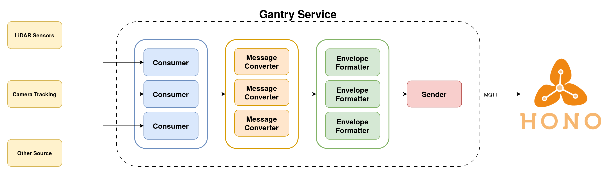
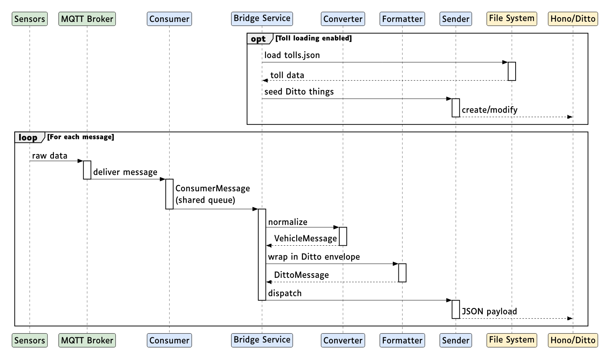

# Gantry Service — Developer Guide

## Architecture Overview

The Gantry Service is an async Python application that bridges road sensor data into Eclipse Ditto digital twins via Eclipse Hono. It follows a layered driver/interface architecture with pluggable components.

### High-Level Data Flow



### Component Interactions



### Tech Stack

| Layer            | Technology                                 |
| ---------------- | ------------------------------------------ |
| Language         | Python 3.13                                |
| Package manager  | [uv](https://docs.astral.sh/uv/) (Astral)  |
| Async runtime    | `asyncio`                                  |
| MQTT             | `amqtt` (async MQTT client)                |
| Webhook server   | `FastAPI` + `uvicorn`                      |
| HTTP client      | `httpx`                                    |
| Data validation  | `pydantic` v2 + `pydantic-settings`        |
| Logging          | `loguru`                                   |
| Type checking    | `mypy` (strict mode with pydantic plugin)  |
| Linting          | `ruff` (with T20 print detection)          |
| Containerization | Docker (python:3.13-slim) + Docker Compose |

### Design Patterns

- **Interface/Driver separation**: All components define abstract base classes in `app/interface/`, with concrete implementations in `app/drivers/`
- **Discriminated unions**: Settings use Pydantic discriminated unions for multi-backend configs (e.g., `ConsumerSettings` can be `MQTTConsumerSettings` or `WebhookConsumerSettings`)
- **Factory pattern**: Each driver module exposes a factory function (`get_consumers()`, `get_sender_interface()`, etc.) that reads settings and instantiates the correct drivers
- **Singleton store**: `MessageConverterStore` holds active converter instances
- **Shared async queue**: All consumers push to a single `asyncio.Queue[ConsumerMessage]` consumed by the bridge service

### Instantiation & Wiring

All component creation happens at **module import time**. The `Settings` singleton is built once, then each driver package reads it and instantiates the correct backend. `BridgeService` simply calls the factory functions and orchestrates the async lifecycle.

#### 1. Settings Singleton

`app/settings/__init__.py` creates a module-level `settings = Settings()` instance. It reads `config.toml` and applies any `GS_`-prefixed environment variable overrides. Every driver module imports this shared instance.

#### 2. Driver Instantiation (at import time)

Each `app/drivers/<component>/__init__.py` executes a `match` on the settings discriminator and conditionally imports + instantiates the correct backend. Some drivers also include a **guard clause** that raises `RuntimeError` if the module is imported when the backend doesn't match — a safety net against accidental direct imports.

| Component | Factory function | Source of truth | Backends |
|-----------|-----------------|-----------------|----------|
| Consumers | `get_consumers()` | `settings.consumers[].backend` | `mqtt`, `webhook` |
| Sender | `get_sender_interface()` | `settings.sender.backend` | `disabled`, `mqtt`, `http` |
| Message Converters | `get_message_converters()` | `settings.message_converters` | `a-to-be`, `outsight` |
| Envelope Formatters | `get_envelope_formatters()` | `settings.envelope_formatters` | `toll-feature`, `ditto-thing` |
| Toll Loader | `get_toll_loader()` | `settings.toll_loader.backend` | `disabled`, `json-file` |

**Guard clause pattern** (used by sender and toll loader drivers):

```python
# app/drivers/sender/mqtt/__init__.py
if settings.sender.backend != SenderBackend.MQTT:
    raise RuntimeError("MQTT Sender driver instantiated but backend isn't MQTT")

mqtt_sender_interface = MQTTSenderInterface(mqtt_settings=settings.sender)
```

This ensures a driver module can only be instantiated when the corresponding backend is active. The parent `__init__.py` only reaches this code via the `match` branch, so the guard is a defensive measure against misuse.

#### 3. BridgeService Lifecycle

```
main.py
  └─ BridgeService()
       ├─ get_queue()              # shared asyncio.Queue
       ├─ get_consumers()          # list[ConsumerInterface]
       ├─ get_message_converters() # MessageConverterStore
       ├─ get_envelope_formatters()# dict[Backend, Formatter]
       ├─ get_sender_interface()   # Optional[SenderInterface]
       └─ get_toll_loader()        # Optional[TollLoaderInterface]

  └─ run()
       └─ _resources() async context manager
            ├─ consumer.loop() tasks     # each runs its own MQTT client / HTTP server
            ├─ sender.start()            # connect to broker or prepare HTTP client
            ├─ _sender_loop() task       # drains send queue → sender.send()
            └─ _clear_loop() task        # periodic Ditto cleanup sweeps
```

**Main processing loop** (inside `run()`):

1. Reads `ConsumerMessage` from the shared queue
2. Dispatches to the correct `MessageConverterInterface` based on `expected_message_type`
3. For each `EnvelopeFormatterBackend` in `allowed_ditto_formats`, calls `format()` → enqueues resulting `DittoMessage` to the send queue
4. `_sender_loop` picks up messages and calls `sender.send()`

#### 4. Adding a New Backend

To add a new implementation for any component:

1. **Interface**: define an abstract base class in `app/interface/<component>.py` with the required methods
2. **Settings**: add a new enum value to the relevant backend enum in `app/settings/<component>.py` and create a Pydantic settings model for the new backend's fields
3. **Driver**: create `app/drivers/<component>/<backend>/` with the concrete implementation, accepting the typed settings in `__init__`
4. **Wiring**: add a `match` case in `app/drivers/<component>/__init__.py` that imports and instantiates the driver when the backend is selected; add a guard clause following the existing pattern
5. **Factory**: the existing `get_*()` function will return the new driver automatically — no changes needed there unless the return type changes
